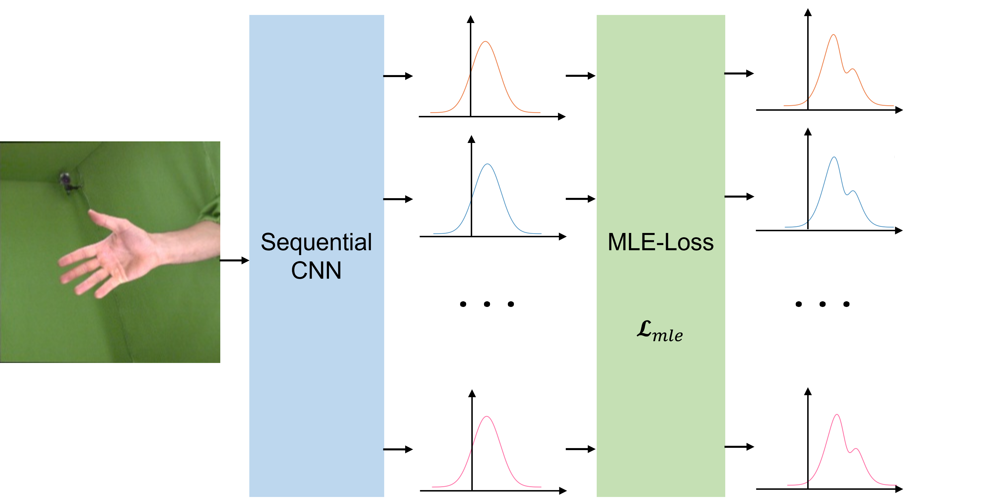

# MLE-Loss-Hand
A multi-stage heatmap based model for hand pose estimation, driven by MLE-Loss.

> ## MLE-Loss driven Robust Hnd Pose Estimation
> Xudong Lou, Xiangxian Zhu, Xin Lin

     
    Regression with Residual Log-likelihood Estimation

## TODO
- [ ] Provide source code after our artical is available for publication.
- [x] Provide experimental data.
